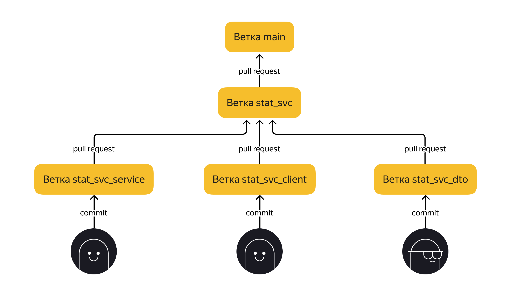

# Этап 1. Сервис статистики

Первый этап — реализация сервиса статистики. Его функционал достаточно прост и ограничен, поэтому начать с него будет лучше всего. Реализация сервиса статистики позволит вам разобраться со спецификацией API и основными требованиями ТЗ, а также подготовить сборку проекта.

## На первом этапе необходимо:

- Реализовать сервис статистики в соответствии со спецификацией: `ewm-stats-service.json`
- Реализовать HTTP-клиент для работы с сервисом статистики
- Подготовить сборку проекта
- Определится с тематикой дополнительной функциональности, которую вы будете реализовывать

## Базовые требования

Разработка должна вестись в публичном репозитории представителя команды, созданном на основе шаблона.

Рабочей ветка для этого этапа — ветка с именем `stat_svc`. Создайте её заранее и отправьте в репозиторий в GitHub.

После этого каждый участник команды должен создать отдельную ветку для работы над своей задачей. В начале названия веток нужно написать `stat_svc`. Например, можно назвать так: `stat_svc_client` — ветка, в которой один из участников разрабатывает клиента статистики.



### Алгоритм работы следующий:

1. Участник команды разрабатывает свою часть функциональности в своей ветке
2. Когда функциональность готова, участник создаёт Pull Request для слияния своей ветки с веткой `stat_svc`, при этом запускаются проверки в GitHub Actions
3. Если все проверки успешно пройдены можно переходить к слиянию

## Что будет проверяться

- **Работающая сборка проекта:**
    - проект компилируется без ошибок;
    - сервис статистики успешно запускается в докер-контейнере;
    - экземпляр PostgreSQL для сервиса статистики успешно запускается в докер-контейнере.

- **Корректная работа сервиса статистики:**
    - все эндпоинты отрабатывают в соответствии со спецификацией;
    - данные успешно сохраняются и выгружаются из базы данных;
    - реализован HTTP-клиент сервиса статистики.

На этом этапе у вас три итерации проверки работы.

## Как подготовить сборку проекта

### Учитывайте многомодульность.

Приложение должно состоять из двух отдельно запускаемых сервисов — в контексте сборки проекта при помощи Maven это означает, что проект будет многомодульным. Но это ещё не всё. Сами сервисы можно также разбить на подмодули.

Сервис статистики должен состоять из HTTP-сервиса и HTTP-клиента. Это значит, что модуль статистики можно разделить на два подмодуля.

Механизм взаимодействия сервиса и клиента предполагает, что они будут использовать одни и те же объекты для запросов и ответов. Исходя из этого, можно выделить еще один подмодуль, в котором будут размещены общие классы DTO.

Структуру модулей и зависимостей можно представить в виде такой схемы.


### Поработайте с файлами.

- модули основного сервиса и сервиса статистики должны содержать `dockerfile`;
- в корне проекта должен быть создан файл `docker-compose.yml`, описывающий запуск контейнеров с сервисами проекта и базами данных для них;
- файл `pom.xml`, описывающий сборку основного сервиса, на данном этапе должен содержать только указание на родительский модуль и идентификатор артефакта.

### Проверьте обязательные зависимости.

Одной из обязательных зависимостей в каждом из сервисов должен быть Spring Boot Actuator. Вот идентификаторы для её добавления:

```xml
<dependency>
    <groupId>org.springframework.boot</groupId>
    <artifactId>spring-boot-starter-actuator</artifactId>
</dependency>
```

## После завершения ревью

Когда все замечания ревьюера будут устранены и ваш Pull Request будет утверждён, не забудьте сделать слияние изменений из ветки `stat_svc` в ветку `main`. Для