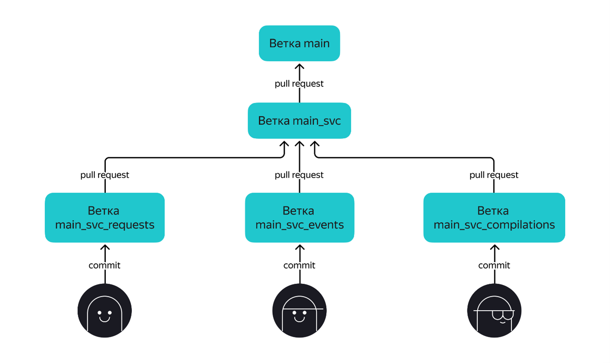

## Этап 2. Основной сервис

На прошлом этапе вы подготовили **Maven-проект** и **модуль статистики**, который состоит из HTTP-сервиса и HTTP-клиента.  
Теперь пришло время реализации **основного сервиса**!

Для начала просмотрите ещё раз техническое задание и изучите спецификацию API основного сервиса.

---

### 🔹 Базовые требования

- Реализация должна вестись в **отдельной ветке** с именем `main_svc`.  
  Эта ветка должна **основываться на ветке `main`**, в которую слиты изменения предыдущего этапа.

- Рабочая ветка для этого этапа — **`main_svc`**.  
  Создайте её заранее и отправьте в репозиторий на **GitHub**.  
  Она обязательно должна **основываться на ветке `main`**, в которой находятся изменения предыдущего этапа.

- После этого каждый участник команды должен создать **отдельную ветку для своей задачи**.  
  В начале названия ветки нужно указать `main_svc`.  
  Например: `main_svc_events` — ветка, в которой один из участников пишет функциональность для работы с событиями.

---

### ✅ Что будет проверяться

#### ⚙️ Работающая сборка проекта
- проект **компилируется без ошибок**;
- **основной сервис** и **сервис статистики** успешно **запускаются в Docker-контейнерах**;
- для **каждого сервиса** запускается **свой экземпляр PostgreSQL** в Docker-контейнере.

#### 🧩 Корректная работа основного сервиса
- все эндпоинты **отрабатывают в соответствии со спецификацией**;
- данные **успешно сохраняются и выгружаются** из базы данных;
- **основной сервис и сервис статистики корректно взаимодействуют**;
- реализация **не производит лишней нагрузки** на базу данных.

---

### 🔁 Проверка и ревью

На этом этапе у вас **три итерации проверки работы**.

---

### 🏁 После завершения ревью

Как и на первом этапе:
- после того как все замечания ревьюера будут устранены и ваш Pull Request будет утверждён —
  **сделайте слияние изменений** из ветки `main_svc` в ветку `main`.

Для этого:
1. Перейдите в ваш Pull Request на платформе **GitHub**.
2. Нажмите кнопку **“Merge pull request”**.

---

Не останавливайтесь — всё получится!  
**Приступайте ко второму этапу!** ヽ(・∀・)ﾉ
